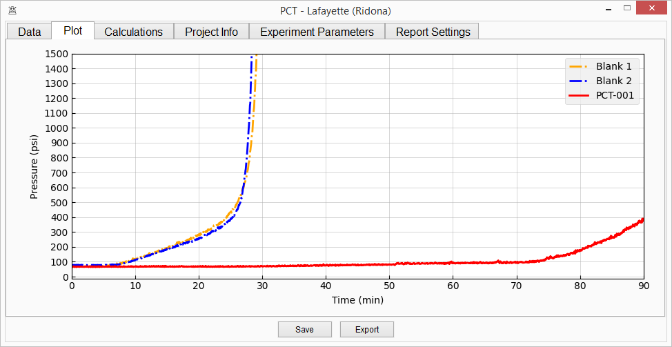

=================================
this space is under construction!
=================================

pct-scalewiz
============

|Code style: black| |pylint Score|

A graphical user interface designed to work with Teledyne SSI MX-class
HPLC pumps for the purpose of calcite scale inhibitor chemical
performance testing.

|main menu|

|evaluation window|

Installation
============
ScaleWiz will be on PyPI soon! 
Until then, it can be installed from source.

Clone the repo, open a terminal there, then run

::

    poetry install

Usage
=====

::

    poetry run scalewiz

Further instructions can be viewed with the Help button on the main
menu.

.. |Code style: black| image:: https://img.shields.io/badge/code%20style-black-000000.svg
   :target: https://github.com/psf/black
.. |pylint Score| image:: https://mperlet.github.io/pybadge/badges/9.91.svg
.. |main menu| image:: img/main_menu(details).PNG

