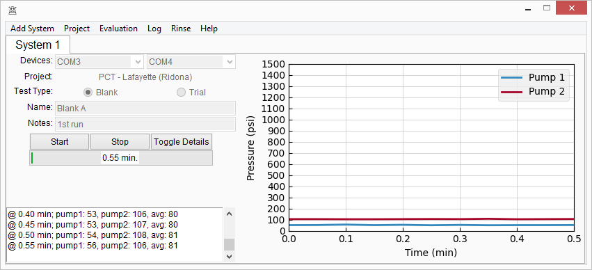

=================================
this space is under construction!
=================================

========================================================================
scalewiz |license| |python| |pypi| |build-status| |style| 
========================================================================

A graphical user interface designed to work with Teledyne SSI MX-class
HPLC pumps for the purpose of calcite scale inhibitor chemical
performance testing.

|main menu|

|evaluation window|

Installation
============

::

    python -m pip install --user scalewiz

Usage
=====

    python -m scalewiz

Further instructions can be viewed in the docs section of this repo or with the Help button in the main
menu.

Acknowledgements
================
 - `Premier Chemical Technologies, LLC`_ for sponsoring development
 -  `@balacla`_ for support and invaluable help in brainstorming

.. |license| image:: https://img.shields.io/github/license/teauxfu/py-hplc 
  :target: https://github.com/teauxfu/py-hplc/blob/main/LICENSE.txt
  :alt: GitHub

.. |python| image:: https://img.shields.io/pypi/pyversions/scalewiz
  :alt: PyPI - Python Version
  
.. |pypi| image:: https://img.shields.io/pypi/v/scalewiz   
  :target: https://pypi.org/project/py-hplc/
  :alt: PyPI

.. |build-status| image:: https://github.com/teauxfu/scalewiz/actions/workflows/build.yml/badge.svg
  :target: https://github.com/teauxfu/scalewiz/actions/workflows/build.yml
  :alt: Build Status

.. |docs| image:: https://readthedocs.org/projects/pip/badge/?version=stable
  :target: https://scalewiz.readthedocs.io/en/latest/
  :alt: Documentation Status

.. |style| image:: https://img.shields.io/badge/code%20style-black-000000.svg
  :target: https://github.com/psf/black
  :alt: Style

.. |code quality| image:: https://img.shields.io/badge/code%20quality-flake8-black
  :target: https://gitlab.com/pycqa/flake8
  :alt: Code quality

.. |evaluation window| image:: img/evaluation(plot).PNG\
.. _`Premier Chemical Technologies, LLC`: https://premierchemical.tech
.. _`@balacla`: https://github.com/balacla
