ScaleWiz User Guide
===================

Starting a new project
----------------------

Launch ScaleWiz using your preferred method, then click 'Project' >
'New/Edit' from the menu bar.

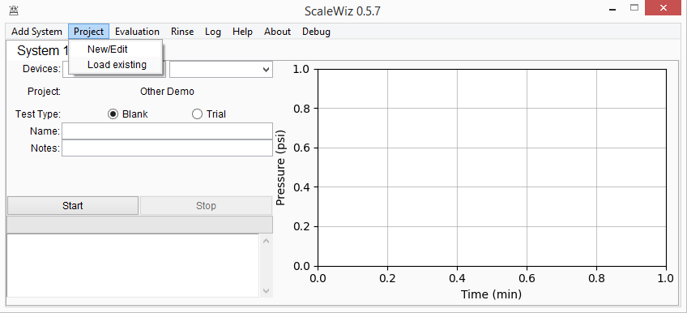

This is the project editor screen. You'll mostly just use it for making
new projects. The information is conveniently divided into three
sections.

Project info
~~~~~~~~~~~~

This will be used to make the report later. Fill out the form with as
much information as you have available. The 'Project name' field will
auto-populate based on the given inputs, but you are free to rename it
as you wish.

If you need to clear a date field, just click its label.

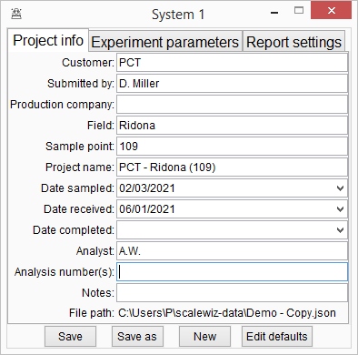

Experiment parameters
~~~~~~~~~~~~~~~~~~~~~

This is the most important one. The first two fields only affect the
final report. The last five fields affect how the tests are conducted
and scored.

-  Baseline pressure: the pressure of pure water flowing through the
   system at the operating temperature and flowrate
-  Limiting pressure: the 'failure threshold' pressure at which the test
   will end
-  Time limit: the maximum duration of the test
-  Reading interval: the delay between pressure measurements
-  Uptake time: time to wait between starting a test and the first
   measurement

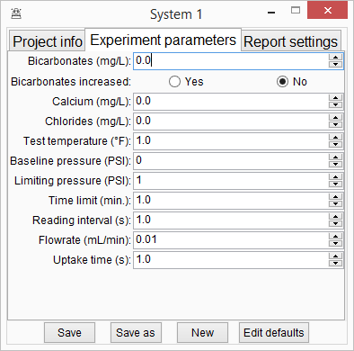

Report settings
~~~~~~~~~~~~~~~

Used to select the report template file. Clicking the file path label
allows you to select the template you want to use for the report.
Currently, the only supported file format is .xlsx.

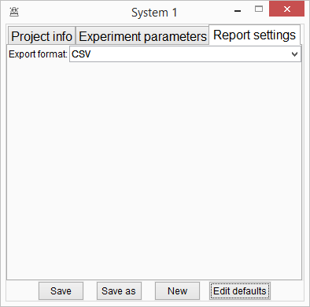

Once you're done filling out all that, click 'Save' to generate the
project file. We will use this to save our data as we run tests, and to
generate a report from later. You can always come back here later to
change something -- just be sure to save your changes.

When you click 'Save' the project will be automatically loaded to the
current System.

Collecting data
---------------

Now that we've got our project file we are ready to collect some data.

If you don't already have a project loaded, click 'Project' > 'Load
existing' from the menu bar. If a project is currently loaded, it's name
will be displayed as shown below.

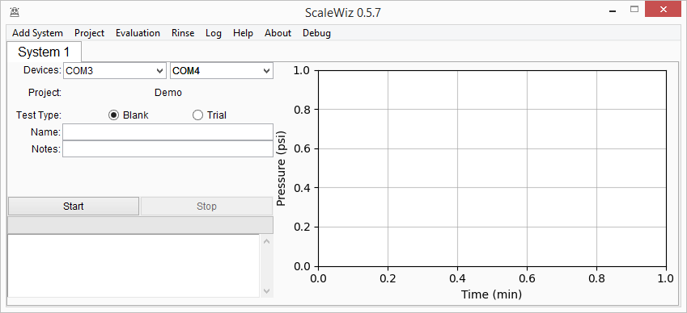

Use the 'Devices' dropdown boxes to select the serial ports the pumps
are connected to. Clicking the 'Devices' label will refresh the devices
list.

Use the 'Test Type' radio buttons to choose the appropriate test type.
This property cannot be changed once the test begins.

Blanks
~~~~~~

If you are running a blank, enter a name for it. The notes field may be
used to store any other relevant information.

 .. image:: ../img/main_menu(blank).PNG
    :alt: blank entry

Trials
~~~~~~

If you are running a chemical performance trial, some additional entries
will appear. Enter the chemical name and the treating rate to the
nearest whole part per million. Use the 'Clarity' dropdown box to select
the treated brine's water quality, or type in your own description.

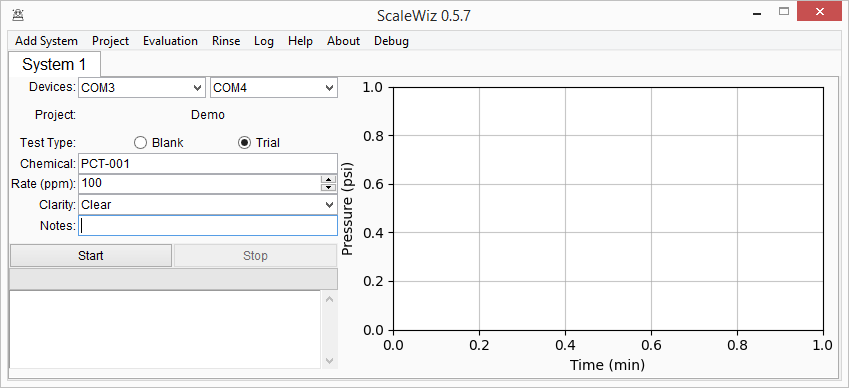

Running the test
~~~~~~~~~~~~~~~~

When you're ready to start the test, hit the 'Start' button. The uptake
cycle will begin, and its status will be shown in the progress bar.

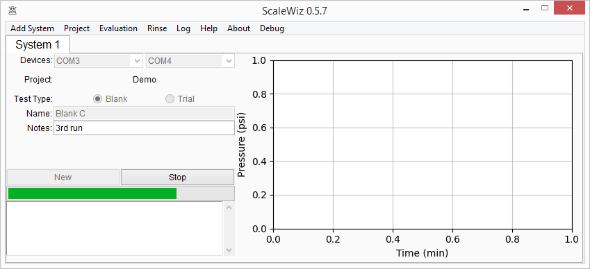

You can interrupt the uptake cycle (or the test itself) at any time by
clicking the 'Stop' button. This will stop the pumps, then attempt to
save the data to file.

A test will automatically stop itself and the pumps when either the time
limit or pressure limit has been reached. The 'Start' button will become
a 'New' button, which you can use to initialize a new test.

Rinses
~~~~~~

Between each test, it is necessary to rinse the system. Clicking 'Rinse'
from the menu bar will create a small dialog that can do this for you.

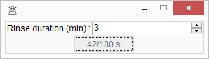

The button will temporarily disable while acting as a status label to
show the progression of the rinse. Closing the dialog will terminate the
rinse cycle.

Analyzing data
--------------

Click 'Evaluation' from the menu bar to open the Evalutaion Window.

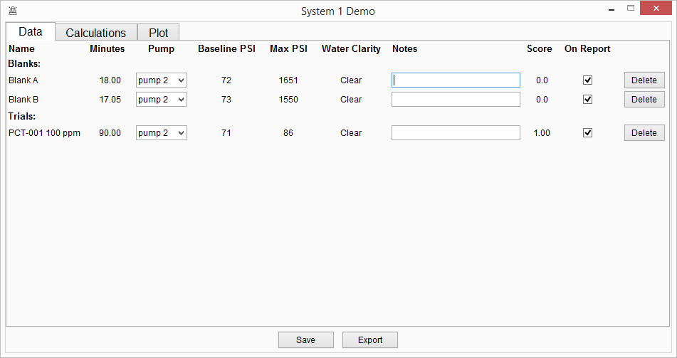

The data for each test in the project will be displayed horizontally as
a row.

-  Minutes: the duration of the test
-  Pump: which series of pressure measurements to use for scoring
-  Baseline PSI: the observed baseline pressure for the selected Pump
-  Max PSI: the highest pressure observed for the selected Pump
-  Clarity: the observed water clarity
-  Notes: any misc. info associated with the test.
-  Result: the test's score, considering the selected Pump and blanks on report
-  Report: a checkbox for indicating whether or not a test should be included on the report

.. note::

   Blanks will only be factored into the scoring process if marked as 'On Report'

Plot
~~~~

The 'Plot' tab displays the most recent plot of all tests with a ticked 'Include on Report' box.
You can change the Label associated with each test using the entries on the right.

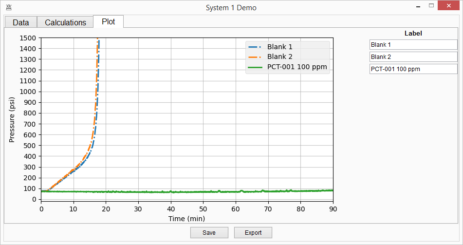

Calculations
~~~~~~~~~~~~

The 'Calculations' tab displays a text log of the evaluation of all
tests with a ticked 'Include on Report' box. This log is automatically
exported next to the report file when you click the 'Export' button.

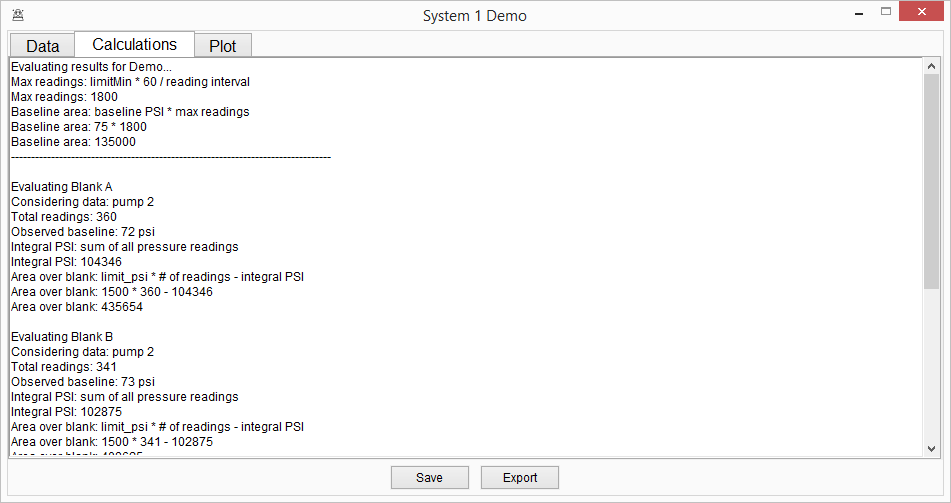

Generating a report
~~~~~~~~~~~~~~~~~~~

You can export a report at any time by clicking the 'Export' button.
This will output, next to the Project's .json file,

- a .txt file copy of the most recent calculations log
- a .jpeg file of the Project's plot
- an either .csv or .json file with a summary of the results

.. note::

   The results are typically exported to CSV for easier parsing in Excel or similar.
   Support for JSON reports are more or less accidental at time of writing.
   If you are able and or willing to parse the JSON, it may be more useful to just work with the Project's JSON file directly.

Running tests concurrently
--------------------------

To run tests concurrently, click 'Add System' from the menu bar. A new
tab will appear on the main menu, and can be used normally.

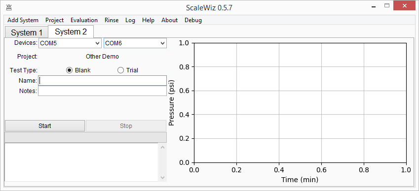

At the time of writing, a particular project may only be loaded to one
'System' at a time.
